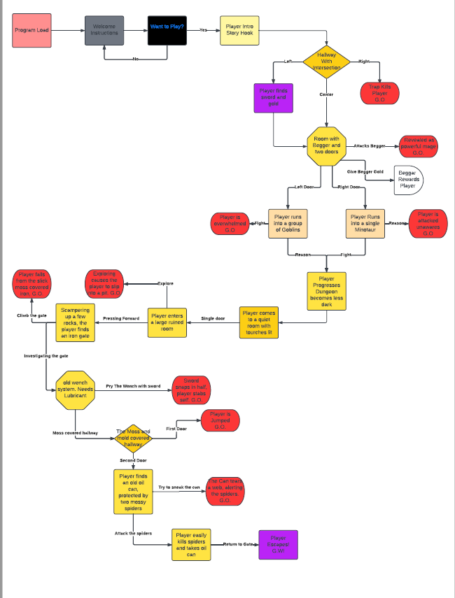

# The Greatest Game: A Text Adventure

The Greatest Game is a text based adventure game running in a Python terminal which is built off the Code Institute mock terminal on Heroku

Users try to figure out the way out of the ruin that they wake up in, battling enviromental and potenitally mystic monsters. 

[Link to deployed project](https://the-greatest-game.herokuapp.com/)

## How to play

The Greatest Game is based on the many text adventure games, you can read more about them here on [Wikipedia](https://en.wikipedia.org/wiki/Text-based_game)

The player simply has to input a decision that your character does. When you see the text being printed to the screen in blue, it means the game is waiting for an input. 

Their are several ways to get to the end of the game, along side a couple secrets and secret endings. 

You win by finding a secret ending, or getting to the exit of the dungeon you're in. 

## User Experiance (UX)

### Project Goals

1. Display clear, coherant text in order to make the game feel intuitive. 
2. Give the player challanging choices and fun secrets to discover
3. Have robust data validation methods 

### User Stories

1. As a user, I want to be able to understand choices avalible to me from the terminal text
2. As a user, I want to be able to ask for hints when I'm stuck
3. As a user, I want to have options to complete challanges

### Colour Scheme

[Colorama](https://pypi.org/project/colorama/) has been used to apply colour to the teminal text. This has been used in order to give the project a more appealing visual look
while also making the interface more intuitive and easier to read. 

The colours being used are:
- Inputs are displayed in Cyan
- Terminal Outs are displayed in Red
- A player death is signified with Green Text
- The player discovering a secret is Magenta text
- Error messages are displayed with a red background. 

### Data Flow

The following flowchart was designed using [Miro](https://miro.com/) in order to plan the flow of data. 

The flow of the players actions are shown here, with secrets branching off from it. 

## Features

### Existing Features

- Colour Coded Text
    - Red Text is simply Terminal output
    - Blue Text is to signify an input requirement
    - Green Text is a Death 
    - Magenta Text is a Secret
    - A Red background is an Error message.

- Input Validation
    - When the player inputs text, the code automatically strips any spaces around the text and converts it to lower case
    - If an invalid input is input, the player is given an error message and returned to the part of the game they where in.

- Replayability, Multiple Endings, Secrets.

- Random Generation of a weapon and gold amount
    - Takes a random weapon from the list and outputs it
    - Generates a random number from 2 to 50 and outputs it

### Future Features

- Add more branching paths
- Create more randomness

## Testing

I have manually tested this project by doing the following
 
1. Ran code through PEP8 linter and confirmed there are no problems.
2. Given invalid inputs; Numbers when strings are expected, capitalisation. 
3. Tested in my local terminal and the Code Insitute Heroku App. 

### Bugs

#### Solved Bugs

- When creating the Random Number output, I had forgotten to set a range, the random number returning between 0 and 1.
- Forgot to add an Else statement to the Spider room for input validation and capture. 

### Remaining Bugs

- No Bugs remaining. 

### Validator Testing

- PEP8
    - No Errors were returned from PEP8 Online

## Deployment

The Project was deployed using Code insitutes mock terminal for Heroku. 

- Steps for Deployment
    1. Fork or Clone the repository
    2. Create a new Heroku app
    3. Set the buildbacks to Python and NodeJS in that order
    4. Link the Heroku app to the repository
    5. Click on Deploy

### Credits

- Code Insitute for the Deployment Terminal