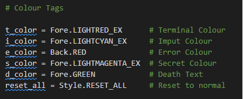
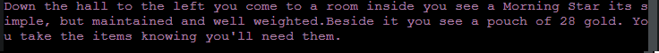

# The Greatest Game: A Text Adventure

The Greatest Game is a text based adventure game running in a Python terminal which is built off the Code Institute mock terminal on Heroku

Users try to figure out the way out of the ruin that they wake up in, battling enviromental and potenitally mystic monsters. 

[Link to deployed project](https://the-greatest-game.herokuapp.com/)

## How to play

The Greatest Game is based on the many text adventure games, you can read more about them here on [Wikipedia](https://en.wikipedia.org/wiki/Text-based_game)

The player simply has to input a decision that your character does. When you see the text being printed to the screen in blue, it means the game is waiting for an input. 

Their are several ways to get to the end of the game, along side a couple secrets and secret endings. 

You win by finding a secret ending, or getting to the exit of the dungeon you're in. 

## Features

### Existing Features

- Colour Coded Text
    - Red Text is simply Terminal output
    - Blue Text is to signify an input requirement
    - Green Text is a Death 
    - Magenta Text is a Secret
    - A Red background is an Error message.

- Input Validation
    - When the player inputs text, the code automatically strips any spaces around the text and converts it to lower case
    - If an invalid input is input, the player is given an error message and returned to the part of the game they where in.

- Replayability, Multiple Endings, Secrets.

- Random Generation of a weapon and gold amount
    - Takes a random weapon from the list and outputs it
    - Generates a random number from 2 to 50 and outputs it

